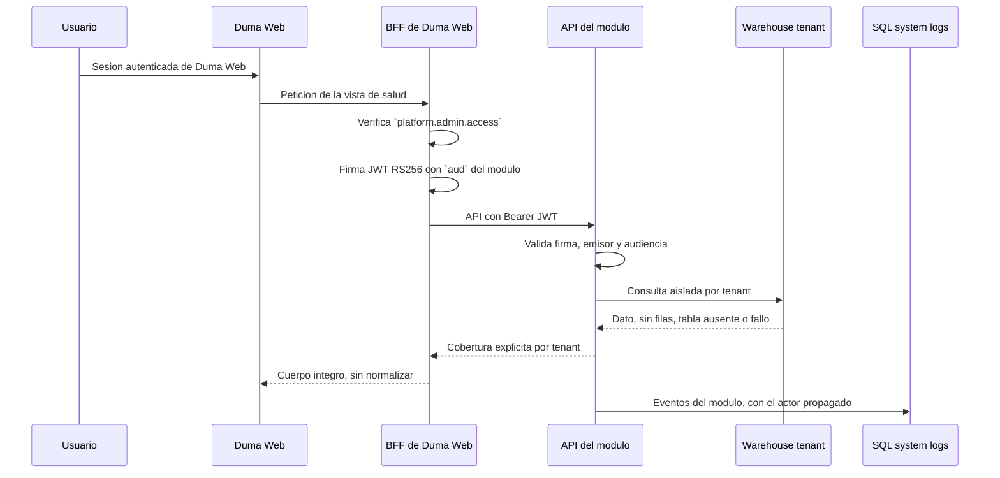

# Operacion, arranque y configuracion

## 1. Alcance

Este runbook cubre el arranque de los tres backends de este repositorio, por separado o en conjunto. **No cubre el arranque de una UI**: desde el retiro del portal el 2026-08-26, quien sirve las vistas de salud es Duma Web, y su arranque se documenta en ese repositorio.

No contiene valores reales de secretos. Los nombres exhaustivos de variables se mantienen junto a cada backend en `application.example.yml`.

## 2. Componentes y puertos

| Aplicacion | Backend | Responsabilidad |
|---|---:|---|
| `experiencia-digital` | 8081 | Experiencia de usuario y disponibilidad |
| `lecturas` | 8082 | Continuidad y excepciones de lecturas |
| `smartaudits` | 8084 | Analitica SmartAudits y revision humana Carls Jr |

El JAR Spring Boot de cada modulo sirve **solo su API**. Ya no empaqueta estaticos: la etapa de Node desaparecio de los tres `Dockerfile` junto con los frontends.

### 2.1 Puertos deterministas

Los tres puertos se definen desde variables canonicas:

| Proceso | Variable |
|---|---|
| Experiencia backend | `DUMA_EXPERIENCE_BACKEND_PORT` |
| Lecturas backend | `DUMA_READINGS_BACKEND_PORT` |
| SmartAudits backend | `DUMA_SMARTAUDITS_BACKEND_PORT` |

Crear una configuracion local a partir de la plantilla y cargarla en la terminal que arrancara los procesos:

```powershell
Copy-Item .\config\ports.example.ps1 .\config\ports.local.ps1
. .\config\ports.local.ps1
```

`ports.local.ps1` esta ignorado por Git y debe contener solamente puertos. Spring Boot, el issuer local, JWKS y CORS derivan de estas variables.

Los nombres anteriores `EXPERIENCE_PORT`, `READINGS_PORT`, `DEVICES_PORT` y `SMARTAUDITS_PORT` siguen aceptados como fallback para no romper ejecuciones existentes. Las variables canonicas tienen precedencia.

## 3. Prerrequisitos

- Java 17 y Maven 3.9, o Docker Desktop para usar la imagen Maven documentada.
- Acceso de red desde cada backend al SQL Server de auditoria.
- Acceso de red desde cada modulo a los warehouses SQL Server configurados.
- Esquemas de base de datos inicializados con los scripts `db/init` de cada aplicacion.
- **Un emisor de tokens alcanzable**, que en la plataforma es Duma Web. Sin el, los modulos arrancan pero rechazan toda lectura.

Ya **no** hacen falta Node, npm ni Chromium de Playwright: eran prerrequisitos de los frontends retirados.

El arranque en conjunto se hace con `scripts\start-environment.ps1`, documentado en
[`runbook-entorno-y-artifacts.md`](runbook-entorno-y-artifacts.md). El camino anterior de `.env` por
aplicacion mas `compose.yaml` y `make up` **se retiro**: sus tres `compose.yaml` fijaban
`DUMA_*_STANDALONE_MODE: true` bajo `environment:`, que gana sobre `env_file`, asi que cualquier
comprobacion de seguridad hecha por esa via era un falso verde. Aquellos archivos siguen en el
historial de Git; `git log --diff-filter=D -- lecturas/compose.yaml` localiza el commit que los quito.

Las conexiones de los modulos se resuelven por tenant dentro de cada feature: `DUMA_TENANTS_<TENANT>_HOST`, `DATABASE`, `USERNAME` y `PASSWORD`. Los campos opcionales `PORT`, `ENCRYPT`, `TRUST_SERVER_CERTIFICATE` y `POOL_SIZE_PER_TENANT` permiten ajustar el transporte por tenant. Al declararse por modulo en `config\runtime.local.ps1`, un mismo tenant puede usar hosts o entornos distintos entre Experiencia, Lecturas y SmartAudits.

## 4. Preparacion de bases

### 4.1 System logs

Cada aplicacion incluye scripts idempotentes en su directorio `db/init`:

1. Ejecutar `01-system-log.sql` en la base indicada por `DUMA_SYSTEMLOG_MSSQL_DATABASE`.
2. Ejecutar `02-system-log-procedure.sql` en la misma base.

Son **seis** en total, dos por modulo. Los dos del portal desaparecieron con el; `audit.system_event` se sigue creando porque los tres modulos la crean idempotentemente sobre la misma base.

Las aplicaciones pueden compartir la base fisica de auditoria, pero cada evento conserva su `application_id`. Los backends no almacenan tokens, contrasenas, comentarios SmartAudits, filas de negocio ni payloads de sensores en `audit.system_event`.

### 4.2 Identidad

**Este repositorio ya no tiene base de usuarios.** `security.app_user` y su script de alta se retiraron con el portal: quien autentica personas es Duma Web, contra su propio catalogo, y los modulos solo validan el token que emite.

### 4.3 Warehouses

Cada modulo abre un pool independiente por tenant. Un nombre de base vacio produce `UNAVAILABLE` solamente para ese tenant. Una tabla ausente produce `NOT_SUPPORTED` y una tabla presente sin filas produce `NO_DATA`; ninguno de estos estados se convierte en cero operativo.

## 5. Variables y secretos

### 5.1 Variables compartidas por backend

| Variable | Secreta | Uso |
|---|---|---|
| `DUMA_SYSTEMLOG_MSSQL_HOST` | No | Host o IP del SQL Server de auditoria accesible desde este equipo |
| `DUMA_SYSTEMLOG_MSSQL_PORT` | No | Puerto SQL Server |
| `DUMA_SYSTEMLOG_MSSQL_DATABASE` | No | Base de system logs |
| `DUMA_SYSTEMLOG_MSSQL_USERNAME` | Si | Identidad de escritura de auditoria |
| `DUMA_SYSTEMLOG_MSSQL_PASSWORD` | Si | Credencial de auditoria |
| `DUMA_SYSTEMLOG_MSSQL_ENCRYPT` | No | Cifrado JDBC |
| `DUMA_SYSTEMLOG_MSSQL_TRUST_SERVER_CERTIFICATE` | No | Confianza explicita del certificado; debe permanecer `false` fuera de entornos controlados |

### 5.2 Variables compartidas por modulo

| Variable | Secreta | Uso |
|---|---|---|
| `DUMA_WAREHOUSE_MSSQL_HOST` | No | Host o IP de warehouses |
| `DUMA_WAREHOUSE_MSSQL_PORT` | No | Puerto de warehouses |
| `DUMA_WAREHOUSE_MSSQL_USERNAME` | Si | Identidad de solo lectura; SmartAudits requiere ademas las escrituras acotadas de la cola |
| `DUMA_WAREHOUSE_MSSQL_PASSWORD` | Si | Credencial del warehouse |
| `DUMA_WAREHOUSE_MSSQL_ENCRYPT` | No | Cifrado JDBC |
| `DUMA_WAREHOUSE_MSSQL_TRUST_SERVER_CERTIFICATE` | No | Politica de certificado JDBC |
| `DUMA_WAREHOUSE_POOL_SIZE_PER_TENANT` | No | Limite de conexiones por tenant |
| `DUMA_AUTH_ISSUER` | No | **Obligatoria, sin default.** Emisor esperado; en la plataforma, `duma-web-internal` |
| `DUMA_AUTH_JWKS_URI` | No | **Obligatoria, sin default.** JWKS publico del emisor, **con el prefijo de grupo** de su ruta |
| `DUMA_<MODULO>_ALLOWED_ORIGINS` | No | Allowlist CORS exacta; vacia si las llamadas son servidor a servidor |
| `DUMA_<MODULO>_STANDALONE_MODE` | No | Permite lectura local sin login; nunca habilita la mutacion SmartAudits |

`<MODULO>` corresponde a `EXPERIENCE`, `READINGS`, `DEVICES` o `SMARTAUDITS`.

Las dos variables de autenticacion **no tienen valor por defecto a proposito**, ni en `application.yml` ni en `ModuleProperties`. Un modulo que no las declare no arranca, porque `NimbusJwtDecoder` rechaza un JWKS vacio. Con respaldo, un despliegue que las olvidara seguiria confiando en quien estuviera escrito en el arbol — que es exactamente el fallo que el retiro del portal cierra.

Un error que ya mordio dos veces: **la ruta del JWKS lleva el prefijo del grupo**. Sin el, la API responde 401 y los tres modulos rechazan todos los tokens, con un sintoma indistinguible de una firma invalida.

### 5.3 Bases por tenant

Los siete nombres se configuran de forma independiente:

- `DUMA_TENANT_CARLSJR_DATABASE`
- `DUMA_TENANT_EMERSON_DATABASE`
- `DUMA_TENANT_VALLEDELENCINO_DATABASE`
- `DUMA_TENANT_MCDONALDS_DATABASE`
- `DUMA_TENANT_MCDONALDS_CDP_DATABASE`
- `DUMA_TENANT_SMARTFIT_DATABASE`
- `DUMA_TENANT_BAFAR_POC_GABINETE_DATABASE`

No se deben inventar nombres. Si una base no esta liberada, la variable queda vacia y el contrato devuelve `UNAVAILABLE` para ese tenant.

### 5.4 Estado visible por modulo

Cada prefijo de modulo define:

| Sufijo | Valores permitidos | Significado |
|---|---|---|
| `RELEASE_STAGE` | `DEVELOPMENT`, `TESTING`, `STAGING`, `PRODUCTION` | Madurez del software |
| `DATA_ENVIRONMENT` | `DEVELOPMENT`, `TEST`, `STAGE`, `PRODUCTION` | Procedencia del dato |
| `FRESHNESS_MODE` | `LIVE`, `SNAPSHOT`, `MOCK` | Frescura declarada |
| `TENANT_SCOPE` | `ALL_TENANTS`, `SELECTED_TENANTS`, `CARLSJR_ONLY` | Alcance declarado |
| `CLEARANCE` | `ACADEMIC_PRIVATE`, `INTERNAL`, `RESTRICTED` | Clasificacion |
| `API_BASE_URL` | URL absoluta | API del modulo |

El sufijo `REMOTE_ENTRY_URL` **ya no existe**: salio del manifiesto al retirarse el protocolo de Custom Elements, y con el de los tres `.env.example` y los tres `application.example.yml`.

El badge informa estas dimensiones por separado. No constituye por si mismo una frontera de seguridad.

## 6. Arranque standalone

Desde la raiz del repo, repetir para el modulo deseado:

```powershell
. .\config\ports.local.ps1
Set-Location .\experiencia-digital\backend
mvn spring-boot:run -Dspring-boot.run.profiles=dev
```

Sustituir el directorio por `lecturas` o `smartaudits`. Antes de iniciar, inyectar en el proceso las variables declaradas en `backend/application.example.yml`.

El perfil `dev` habilita lectura standalone aplicando `permitAll` a todo. **Sirve para desarrollo local, nunca para comprobar seguridad.** SmartAudits mantiene bloqueada la aprobacion de su cola porque exige `SCOPE_observability:write`, que solo llega en un token real.

## 7. Arranque integrado

El punto de entrada es Duma Web. Desde este repositorio:

1. Inicializar las tablas y procedimientos de auditoria.
2. Cargar `config/ports.local.ps1` en cada terminal u orquestador.
3. Inyectar variables y secretos de los tres modulos, **incluidas `DUMA_AUTH_ISSUER` y `DUMA_AUTH_JWKS_URI`**, sin las cuales no arrancan.
4. Iniciar los tres backends **sin** el perfil `dev`.
5. Comprobar que responden `401` sin token en `GET /api/{modulo}`. Si responden `200`, estan en standalone y la autenticacion no esta corriendo.
6. Arrancar Duma Web y acceder por su URL.

Comando de backend en cada directorio:

```powershell
mvn spring-boot:run
```

Duma Web puede iniciar antes que un modulo; ese modulo se reportara como no disponible de forma aislada, sin derribar el resto de las vistas.

## 8. Orquestacion y comunicacion



El navegador **nunca ve estos tokens**: las llamadas son de servidor a servidor y no hay CORS que configurar. Cada API valida `iss`, firma, expiracion y `aud`; un token de un modulo no es aceptado por otro.

El BFF valida solo el sobre —status de transporte, JSON parseable, llaves de primer nivel— y reenvia el cuerpo integro. **Cualquier normalizacion intermedia es un punto donde los cuatro estados de cobertura pueden colapsarse entre si.**

## 9. SmartAudits

La analitica consulta los siete tenants con el mismo aislamiento de cobertura. La cola humana usa exclusivamente la base `carlsjr`, acepta solo `AiResult = 0`, cinco categorias permitidas y una llave compuesta de hash mas resultado. La aprobacion web ocurre en una transaccion directa y finaliza en `APPROVED`; no escribe el lookup, no invoca el job automatico y queda disponible para el proceso de promocion posterior.

Aprobar exige `SCOPE_observability:write` en el token. Leer la cola, no.

## 10. Validacion reproducible

La raiz contiene `scripts/validate.ps1`:

```powershell
powershell.exe -NoProfile -ExecutionPolicy Bypass -File .\scripts\validate.ps1
```

El comando ejecuta `mvn verify` con Java 17 y Testcontainers SQL Server sobre el reactor de tres backends, y comprueba la evidencia Failsafe de cada uno. Cada corrida crea evidencia local en `docs/auditoria-temporal/runs` sin leer `.env` ni imprimir secretos.

**Ya no invoca `npm`.** Perdio con los frontends sus fases de lint, unitarias de Node, build y E2E, y con ellas los parametros `-Install` y `-SkipE2E`.

Opciones:

- Cargar otro archivo de puertos: `-PortsFile C:\ruta\ports.local.ps1`.

`ExecutionPolicy Bypass` aplica solo a ese proceso y no modifica la politica del equipo.
